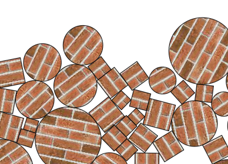

# Warzone

OOP个人大作业文档

[OO设计](./OO-Design.pdf)

## 概述

我的个人大作业项目名称为“Warzone”，是一款基于Qt和LiquidFun开发的二人回合制对战游戏。本文介绍Warzone这款游戏的开发动机，玩法和规则，详细叙述了开发游戏的过程和重点功能的主要开发思路。最后，侧重介绍我在本次项目中用到的OOP设计方法和技巧。

上图为我设计的游戏图标。

## 开发动机

由于转系等原因，我的程序设计系列课程的选修顺序应该是计算机系数一数二的不典型了😁，从FOP到Qt到软件工程到数据结构最后到OOP【捂脸】，OOP可以说是我在大学中修过的说不上新鲜但也收获颇丰的一门课。与其说她教会了我C++的编程思想，不如说是对我三年里接触到的所有程序设计能力的全集，包括软件开发、C++语言习惯、代码风格的一次总结升华与终极运用。

所以，带着希望做出一些有意义、有挑战性的项目的心理，我选择了第二个题目作为本学期个人大作业的课题——用LiquidFun库设计一款游戏。这看似简单，好像只需调库即可，但其实也是我觉得所有选题里最深不可测的一个。因为本题是所有题目里自由度最高的一个，游戏的设计可以多种多样，可以很简易，也可以很复杂，但一定要别出心裁。

我可以算是一位比较忠实的游戏玩家了吧，从小到大玩过无数的单机游戏，过往的很多游戏虽然体量小，但其精巧的规则设计总是让我赞叹不已，欲罢不能。可说到游戏开发，我可以说是毫无头绪，除了编写过一些练手用的贪吃蛇、五子棋外，丝毫未曾接触过大一些的游戏开发过程，就连怎么把游戏画面显示在屏幕上，也是未尝试探过。

另外，如何调用第三方库，“站在巨人的肩膀上”编程序，把LiquidFun无缝地整合到工程中，对我来说也是不小的挑战。

困难重重，但兴趣的驱动力是无限的，于是我下定决心开始了本作的开发。而且一旦开始，便一发不可收，因为游戏的开发简直比玩游戏更让人上瘾啊！

------

那么，做个什么游戏好呢？

我脑子里有着千百种选择。但一时间，一款我从小就爱不释手的经典游戏划过我脑海——Worms

这是一款非常经典非常可爱的二人回合制对战游戏。游戏双方各有一只虫虫队伍，手上各有一堆五花八门的武器——火箭筒、手榴弹、散弹枪、炸药……双方轮流对抗，谁能用手头的武器，将对方的虫虫斩尽杀绝，谁就取得最终的胜利✌️

游戏对战场面图：

相关游戏规则这里就不赘述了，总之非常妙趣横生，游戏其实非常考验玩家对各种武器的运用能力，比如火箭筒的瞄准，手榴弹的抛出力度等等，而这些精准的控制都是通过键盘操作来完成的。

这就启发了我，何不用学过的Qt框架，开发一款基于LiquidFun物理引擎的回合对战游戏呢？而且还能致敬童年的经典。所以游戏就得名Warzone了，因为我设计的也是二人对战游戏。但考虑到虫子的绘图比较困难，本人手比较笨，那就干脆用圆圈代替虫子了吧（反正操作手感也差不多hh）。

那么接下来要做的事情，想一想也不多，无非是游戏引擎的搭建，和游戏前端的设计。

## 游戏功能

从需求分析的角度，我们先来想想用户玩家希望怎么样来玩这个游戏？

- 首先，游戏要有一个游戏画面，能显示出当前的战局，双方的部队都分布在哪，血量各是多少。地形是怎么样的，障碍物也要能显示出来。当前正在飞的武器，比如火箭，也要显示在画面里。总体游戏画面截图：

  

- 游戏要有输入界面(interface)，包括：

  - 用键盘操作部队的移动和瞄准：

    - WASD瞄准到不同的方位；

    - 长按回车或者J键跳跃，并且按得越久跳得越远；

    - 长按空格或者K键攻击，并且按得越久蓄力越大。下图展示了一次蓄力过程

      

  - 用鼠标选择武器：至少支持三种武器才好玩吧，比如我选择的是火箭筒、手榴弹和散弹枪这三种经典武器。如下图：

    

  - 如果本回合当前控制的部队不方便操作，玩家可以鼠标点击Skip来放弃本回合操作。（这样可以免得误伤自己或队友）

  - 当然，开始和重新开始按钮Start必不可少。

  - 有一个下拉菜单，可以选择不同的游戏地图开局，这样游戏会趣味的多。

  - 有一个帮助按钮，告诉玩家怎么操作，这样游戏会人性化一些。

  - 下图为鼠标可点击的选项截图：

    

- 输入界面和游戏画面要受某些逻辑控制，比如：

  - 当当前回合玩家发射了一个火箭弹后，它正在飞行，碰撞到敌军，爆炸，敌军被炸飞，敌军死亡，敌军爆炸…… 这一系列过程中，玩家是不能操作部队的移动和攻击的，因为开火之后本轮就算有“操作”了。

    

  - 当当前的玩家按下回车开始跳跃之后，部队在落地之前也是不能瞄准、攻击和二段跳的，所以这时游戏界面也应该禁止这些操作。

  - 当前玩家开火之后，等一切武器效果结束了，下一回合就该提示另一个玩家操作了，而不是上一个玩家。下图为切换玩家后的提示：

    

  - 当一方全军覆没后，对方将获胜，游戏要有决出胜负的功能：

    

大的规则和功能基本上是以上这些，此外还有非常多不易叙述的细节逻辑等待我们去实现，下文也会具体介绍其中一些。

## 游戏内部实现

在以上需求的驱使下，我们需要巧妙地设计游戏后端（Backend），来实现这些功能。

由于用到LiquidFun第三方库来模拟游戏中的物理计算，在场景比较复杂，武器、部队、障碍物较多的时候，计算开销可能较大。另一方面，Qt为我们提供了2D绘图引擎，在场景更新比较频繁的时候，绘图带来的时间开销也是较大的。

所以我们采用一种类似于“CS”架构的游戏前后端架构方案：前后端分别运行于不同的线程，前端负责绘图、和用户输入进行交互，后端管控逻辑、同时模拟游戏中的物理过程，二者通过请求-响应的异步或同步机制实现沟通，共同构成游戏的整体。关系如下图所示：

### 核心类

其中，我设计了两个重要的类，分别负责后端与前端的核心逻辑控制：

- **MainWindow**，继承QWidget，负责接收用户的输入、呈现游戏画面。并时刻保持与后端的游戏数据同步。
- **GameSystem**，是游戏后端的枢纽。负责维护游戏规则，指派LiquidFun的b2World在线程中对世界进行模拟，安置双方的部队，检测有没有兵受伤、死亡等等。

它们与其他类的主要关系如下图表示：

下面介绍后端的重要的几个类：

### Actor

游戏中几乎任何“对象”都是由两部分构成的：

- 对象的物理实体，它们由LiquidFun的b2Body提供相应的物理属性支持——质量、转动惯量、位置、速度矢量、弹性系数、摩擦系数等等……
- 对象的图形显示，即一个物体要以什么形状、样式显示在游戏画面中，它可由Qt为我们提供的重要基类QGraphicsItem和QGraphicsItem来实现。

考虑到b2Body是由b2World通过工厂方法创建的，管理起来相对麻烦，而QGraphicsObject作为Qt绘图中的一个基类，它更加灵活多变，可以被继承以绘制各种各样的图形对象。所以我们可以继承QGraphicsObject，组合一个b2Body的指针来得到游戏的基本图形对象类——Actor。

这样，一个Actor需要实现QGraphicsItem的paint、boundingRect等虚方法，同时需要适当地维护和读取它对应的b2Body实体中的数据。只要实现适当，它就能达到我们想要的效果——既有物理属性，又能正确显示。

同时，让Actor实现QGraphicsItem的虚方法advance，该方法能定义物体如何在游戏过程中运动、旋转，我们在这里直接将Actor的图形坐标与`m_body`的LiquidFun物理坐标以一定比例缩放、绑定即可完成从物理真实位置到舞台位置的同步，这么做的方便之处在于，所有Actor的子类都可以继承这一“绑定”性质，无需重复实现。

需要指出，Actor类在本作当中依旧是一个模板类，它几乎是任何游戏对象的父类——兵、武器、可摧毁的障碍物、不可摧毁的地面……

### AnimateActor

前面提到，兵是一种Actor、可摧毁的障碍物也是一种Actor，而且注意到两者都有“可受伤”和“可被摧毁”的属性，我们可以先定义它们共同的祖先——AnimateActor，来描述这种“有生命”的特征。

AnimateActor同样为模板类，它不仅有物理实体`m_body`，还拥有生命 `m_life`。当其受到伤害或生命耗光时，会发出相应的Qt信号，以便GameSystem能接收到这些信号并进行相应的处理。

这个类需要拥有 `takeDamge` 和 `setLife` 方法，调用者可以让它“受伤”，或是初始化一个生命值。

### Soldier

兵是游戏中的主角，双方的所有部队都是一个个的兵。它们大小不一，生命值、攻击力也各异，分红黑两方。它们行为复杂，可以使用武器相互对打，也可以拔腿逃跑（跳跃）。

为了实现兵的这些行为，我们首先让它继承AnimateActor，成为一个有生命的对象。然后定义了一系列描述其状态（是否被当前轮选中，是否可移动等）、攻击力（攻击时的伤害指数）、大小（个头越大，质量越大，行动能力越差，但攻击力越强）。

挨个挨个定义函数，实现兵的主要行为：

- `jump`：让兵朝着某个方向跳跃一段距离（简便起见，跳跃是唯一的移动方式，而且可以通过力度控制来实现不同距离的跳跃）。该方法可以通过调用 `m_body->ApplyLinearImpulse` 来实现，这时LiquidFun会为我们记录下兵跳跃的初速度，后续模拟中就会自动体现出兵的跳动。
- `setoff`：兵在耗尽生命值后，会在本轮结束时爆炸（这是为了致敬经典Worms的设定），造成一定的游戏趣味，所以需要支持自爆的方法，在它们死了之后，由GameSystem在本轮结束时调用。自爆的实现原理和武器的爆炸相同，这里先不介绍。
- `paint`：这是QGraphicsItem模板类的虚方法，交给我们来实现图形改怎么绘制。游戏中我们将兵绘制为一个圆，当它被选中时，会有金黄色的边以提示玩家，同时头顶会有血量显示。

由于一个队伍共用一套武器，拿武器攻击可以完全在GameSystem中实现，所以不罗列在兵的方法中。这样做其实便于对武器的生命期进行管理。

红方、黑方各自继承Soldier得到两种不同颜色的兵。

### Brick

砖块是有血量的障碍物，它们可以被摧毁，所以也继承了 AnimateActor。

砖块可以是多边形、方形，也可以是圆形（当然这是因为LiquidFun支持这两种主要的形状hh），所以它的paint方法需要能兼容绘制多种b2Shape，我们单独用一个函数 `drawFixtures` 来实现这种兼容绘制。

砖块由于是没有生命的被动物体，所以其移动、旋转等过程也是由GameSystem来维护的，我们无需多加定义。

为了方便，定义出多种静态方法创建三角形、U型、方块状等多种造型的砖块。

砖块也可以有不同纹理，我们将纹理画刷的指针保存在成员中。

不同造型的砖块：

### Land

地面在游戏中起到支撑部队和障碍物的作用，即一个很大的容器，而且是不可移动和摧毁的。（b2_staticBody）它的实现较为简单，只用定义其物理实体的形状和属性。b2World会自动帮我们实现支撑和容纳的逻辑。

在绘制时，可以用纹理画刷，使我们的场景更加生动有趣。

### Weapon

武器是Warzone游戏中一个很大的门类，与它相关的类也很多，主要关系如下图：

武器在我们的游戏中只有三种阶段：发射前，发射后，引爆。

在发射前阶段，武器并没有被“点燃”，而是在步兵的手中（实际并没有显示出来）。发射后，武器会在空中腾飞，例如火箭弹、散弹枪的子弹射出后在空中飞行，手雷抛出后在空中掉落。引爆是在武器达到引爆条件后，发生爆炸，对周围物体或兵造成冲击和伤害，同时武器也从场景消失。

所以武器需要实现这2种虚方法：

- `launch()`使武器发射；
- `trigger()`使武器引爆。

子类在实现引爆了武器的逻辑时，需要实现的物理效果是让引爆点邻域范围内的物体被推飞一段距离。我的做法是，在爆炸点附近搜索一定半径范围内的物体（定义了一个ExplosionCallback类，继承b2QueryCallback，调用LiquidFun的接口来做AABB范围查询），然后根据它们到爆炸点距离的不同施加相应的冲量和伤害值。

但是光有引爆的逻辑，没有视觉效果，游戏体验很不爽，因此我们还需要实现一个爆炸特效，幸运的是，Qt为我们提供了QPropertyAnimation这一类，让我们可以很方便地用图片或者图形创建动画（我用一个专门的ExplosionEffect类及其三个子类来实现三种的不同爆炸特效，感兴趣可以读我的源码）。

注意到三种武器的特效不同，我们给武器加上`createExplosion()`这一虚方法，让子类的每种武器分别创建不同ExplosionEffect的实例。这里运用的其实是**工厂方法**的设计模式。

不同的爆炸效果图：

虽然我实现了三种武器，但我们还是可以把武器从抽象到具象地分为两大类：接触式触发的武器(ContactWeapon)和定时触发武器(TimingWeapon)。

------

#### ContactWeapon

接触武器，顾名思义，就是当且仅当武器与任何物体发生接触，且接触速度大过一定阈值，就会引爆。具体实现需要借助另一个类 ContactListener，它继承了b2ContactListener类，可以安装到b2World中，相当于一个专门监听碰撞的“事件过滤器”，在这里我们对所有的碰撞判断，如果碰撞体中有一个是接触类武器，并且接近速度超过阈值，就在这里调用`trigger`，引发爆炸。

最后，ContactWeapon分为Bazooka和Shotgun两种，这两种武器比较类似，都是在空中做抛物线运动，launch方法只需实现初速度，飞行过程中调整炮弹的姿态和绘制的角度，以获得逼真的导弹飞行效果。

火箭筒：

散弹枪：

Bazooka的伤害值、爆炸半径较大；而Shotgun飞行速度极快（子弹速度），爆炸半径、伤害较小，但是有三发，呈三个角度发射，近距离效果感人。

------

#### TimingWeapon

定时引爆武器，是在一定时间过后引爆的武器，而与是否接触无关，Warzone中只有手榴弹Grenade属于这类武器。

launch同样通过设置手榴弹的初速度来实现。trigger则是通过一个QTimer计时器，计时到规定时间（比如3s）后，异步调用trigger函数。

------

以上是主要的游戏画面中的对象类了，除吃之外还有FrontSight（瞄准十字叉）和ChargingFrontSight（蓄力槽）等Actor，它们和游戏的前端输入有关，可以辅助玩家瞄准和可视化蓄力程度。

下面一大类管理了游戏在物理模拟和图形显示之间的并行机制。

### Engine

Engine是一个子线程，负责代理计算游戏中的物理模拟，从而让主线程中的图形渲染、逻辑控制与密集计算独立开来，高效、流畅地更新游戏画面，提高游戏体验。

它继承了QThread，以实现复杂的并行逻辑。可以在完成每一步物理模拟时发送requiresUpdate信号，以通知主线程GameSystem更新游戏画面，实现游戏画面与逻辑的同步。

主要有syncSimulate和asyncSimulate两种方法，前者是在游戏初始化的时候，快速将舞台模拟到位，达到平衡态，中途不发出requiresUpdate信号。后者是游戏日常进行中，比如火箭在空中飞行、砖块被炸到半空、步兵被炸飞致死等等，一边模拟（每隔一段时间模拟一帧，保持帧频率与LiquidFun模拟频率相同，以达到逼真效果），一边发送requiresUpdate信号，这样主线程同步显示了模拟的全过程，丰富游戏的视觉体验。

由于游戏全程只有一个世界，我只定义了一个Engine的单件，存储在静态，方便在各个部分直接访问代理引擎的数据。

### Initializer

游戏一般都有很多关卡或地图，不同的地图中，角色的分布、场景的情形都是不同的。这一部分本来应该是种植在GameSystem中的代码，但逻辑上其实可以和游戏系统解耦，这样也降低了GameSystem的维护成本。

同样用模板类的思路，先定义模板类，它需要initUnits（初始化角色位置），initLand（初始化地形），initBricks（初始化障碍物的分布）这三种虚方法，然后让子类去实现这三种初始化方法。（这里其实是类似Strategy的设计模式）

目前我实现了三种地图：

经典地图：

城堡对战：

双层：

这些地图在初始化时有一定的随机性，增加了游戏趣味，同时还有一些细节和彩蛋，欢迎玩家亲自探索😁

## 总结

以上就是本作中设计的主要类与游戏框架了。总的说来，虽然是我游戏开发的处女作，但从我和朋友们的游戏体验来看，本作还算是比较成功、比较趣味的一款小游戏，也致敬了我心爱的童年经典。

在个人项目开发中，我充分巩固了在Qt、LiquidFun中学到的知识，不只是对一个个接口的简单调用，还有融入了更多OOP设计方面的精神。用到的设计模式包括：模板类、工厂方法、参数工程、单件、观察者、策略等等。

以下是一些代码统计数据。

